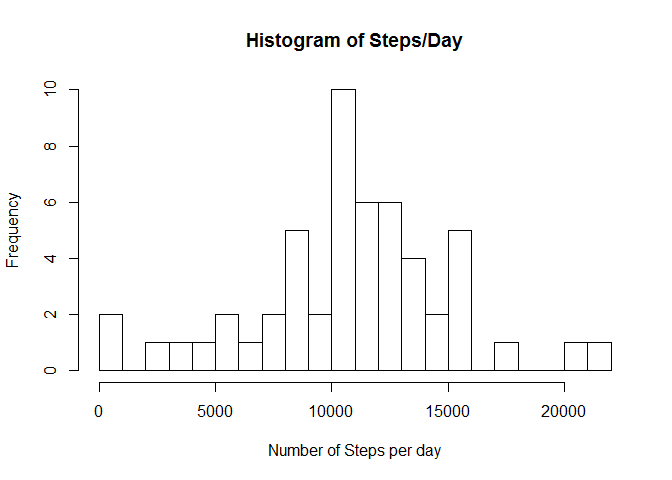
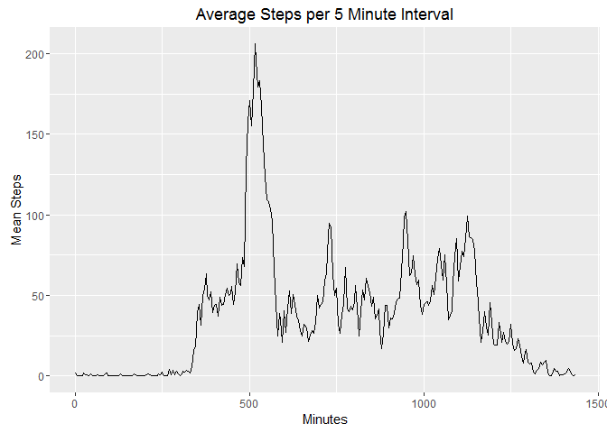
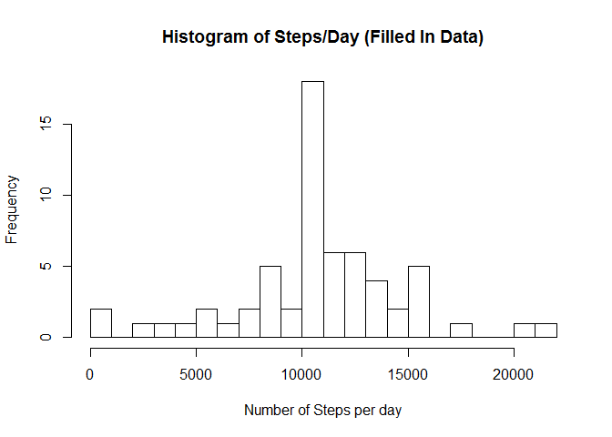
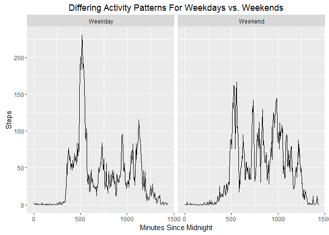

# Reproducible Research: Peer Assessment 1
Andrew Mendelsohn  
March 31, 2016  


## Loading and preprocessing the data
This R markdown file assumes that data file activity.zip is in the same
directory as the markdown file. The activity.csv file is unzipped As part
of the script.We begin by unzipping and loading the
.csv file. We'll make a version that strips NAs so we can do initial exploration
before determining how to replace the missing values. We'll also add a column which will
be the date in lubridate format which will make it easier to determine weekday. The interval
column is coded as 0-55,100-155,200-255-- in other words the hour is coded in the hundreds digits.
We will add a column which is simply 0-55,60,65,70,... to provide a uniform x-axis for our graphs


```r
library(dplyr)
```

```
## 
## Attaching package: 'dplyr'
```

```
## The following objects are masked from 'package:stats':
## 
##     filter, lag
```

```
## The following objects are masked from 'package:base':
## 
##     intersect, setdiff, setequal, union
```

```r
library(lubridate)
library(ggplot2)
library(stringr)

unzip("activity.zip")
actOrig <- read.csv("activity.csv")
actMod1 <- mutate(actOrig, datep = ymd(date), int2 = 60*(interval %/% 100) + (interval %% 100) )
actMod1cln <- actMod1[!is.na(actMod1$steps),]
```


## What is mean total number of steps taken per day?
We'll use summarize to find the total number of steps for each day,
then get the mean of that number. We'll also plot a histogram of the number of steps.

```r
sByDay <- summarize(group_by(actMod1cln,date), tStep = sum(steps))
print(paste("Mean Total Steps per Day =",format(mean(sByDay$tStep),nSmall=2)))
```

```
## [1] "Mean Total Steps per Day = 10766.19"
```

```r
print(paste("Median Total Steps per Day =",format(median(sByDay$tStep),nSmall=2)))
```

```
## [1] "Median Total Steps per Day = 10765"
```

```r
hist(sByDay$tStep, breaks=20, xlab="Number of Steps per day",main="Histogram of Steps/Day")
```



## What is the average daily activity pattern?
Once again, we'll use summarize to find the average number of steps for each interval

```r
sByInt <- summarize(group_by(actMod1cln,int2),mStep = mean(steps))
with(sByInt,qplot(int2,mStep,main="Average Steps per 5 Minute Interval",geom='line',xlab="Minutes",ylab = "Mean Steps"))
```


We also find the interval with the maximum steps and compute the corresponding time of day

```r
maxInt <- sByInt$int2[which.max(sByInt$mStep)]
mt <- dmy("1:1:2016")+minutes(maxInt)
mt <= as.character(mt)
```

```
## [1] TRUE
```

```r
mt <- str_sub(mt,start=-8)
print(paste("Maxium Steps Occur at Minutes =",as.character(maxInt)))
```

```
## [1] "Maxium Steps Occur at Minutes = 515"
```

```r
print(paste("which corresponds to time =",mt))
```

```
## [1] "which corresponds to time = 08:35:00"
```

## Inputing missing values
For each NA value in the original steps column, we will replace it with the average value for the corresponding interval
that we've just computed. Then we'll replot the histogram and the mean and median.

```r
for (i in 1:dim(actMod1)[1]) {
    if (is.na(actMod1$steps[i])) {
        intv <- actMod1$int2[i]
        inx  <- which(sByInt$int2==intv)
        actMod1$steps[i]=sByInt$mStep[inx]
    }
}
sByDayFill = summarize(group_by(actMod1,date),tStep=sum(steps))
hist(sByDayFill$tStep, breaks=20, xlab="Number of Steps per day",main="Histogram of Steps/Day (Filled In Data)")
```



```r
print(paste("Mean Total Steps per Day (Filled Data) =",format(mean(sByDayFill$tStep),nSmall=2)))
```

```
## [1] "Mean Total Steps per Day (Filled Data) = 10766.19"
```

```r
print(paste("Median Total Steps per Day (Filled Data) =",format(median(sByDayFill$tStep),nSmall=2)))
```

```
## [1] "Median Total Steps per Day (Filled Data) = 10766.19"
```
Neither the histogram or the mean and median show significant differences after filling in the missing values.

## Are there differences in activity patterns between weekdays and weekends?
We'll use our newly filled dataframe actMod1 to answer this question. First we'll add a logical
column weekend to differentiate weekend days. Then we'll create a summary by interval and weekend and plot it.

```r
actMod2 <- mutate(actMod1,weekend=wday(actMod1$datep)%in%c(1,7))
sByInt2 <- summarize(group_by(actMod2,int2,weekend),mStep=mean(steps))
sByInt3 <- mutate(sByInt2,weekend = as.factor(weekend))
levels(sByInt3$weekend) = c("Weekday","Weekend")
qplot(int2,mStep,data=sByInt3,geom='line',facets = '~weekend',main="Differing Activity Patterns For Weekdays vs. Weekends",xlab="Minutes Since Midnight",ylab="Steps")
```



***
As expected there is a significant difference in activity patterns for weekdays and weekends. Weekdays show an activity spike near 8:00am when presumably people are zipping off to work while weekends have a more uniform activity level.
